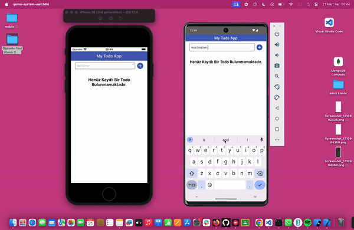

<h1> ReactNative_TodoApp </h1>

Notes App is a React Native mobile application designed for users to easily manage their notes. This app includes basic functionality such as listing, editing, deleting your notes, and tracking their read status. Notes are shown with a green circle when unread and a gray circle when read, so users can easily understand the read status of notes.

<h2> Screenshot </h2>

# ReactNative_TodoApp
